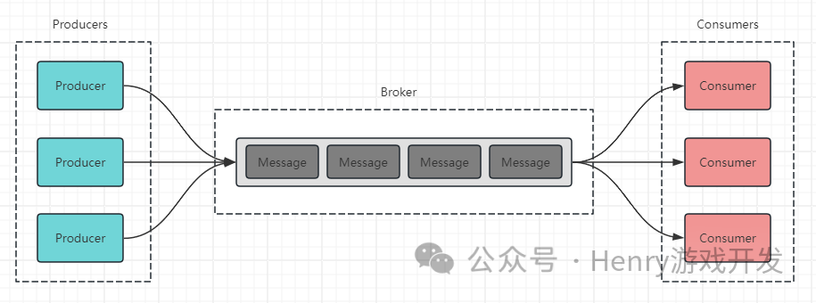

## 什么是消息队列

消息队列源于消费者生产者模式，即由生产者（Producer）、消息处理中心（Broker）、和消费者（Consumer）三者构成的一种设计模式

在消息队列中，有点对点和发布订阅两种模式

1. 1. 点对点模式：多个生产者向同一个队列发送消息，每个消息只能由一个消费者消费
    
2. 2. 发布订阅模式：每个消息都能被多个订阅者获取和处理

## 为什么要使用消息队列

消息队列（MQ）提供三个核心功能：解耦、异步处理和削峰。

1. 1. **业务解耦** 是指在分布式系统中，各组件或服务之间不直接通信，而是通过消息队列进行交互。这种方式使得各组件可以独立地进行更新和扩展，增强了系统的灵活性和可扩展性。例如，在电商平台中，订单服务和支付服务可以通过消息队列进行通信，互不影响，从而减少系统间的直接依赖。
    
2. 2. **异步处理** 意味着系统的不同部分可以在不同的时间处理信息，从而提高整体效率和响应速度。在异步模型中，一个服务可以发送消息到队列，而不需要等待接收服务的响应。这种模式在高流量应用中尤其重要，如社交媒体平台中的消息传递。
    
3. 3. **流量削峰** 指的是使用消息队列来应对短时间内的高流量。通过消息队列，可以平衡负载，确保系统在面对高峰流量时不会崩溃。例如，在促销或大型销售事件期间，消息队列可以帮助电子商务网站处理突发的大量订单请求。

## 有哪些生产者消费者的模型

1. 1. Java的ThreadPoolExecutor：某种意义上来说，Java的线程池也是消息队列的实现思想，我们往线程池投递任务之后，这些任务其实是投递到了Queue里，而线程池中的线程会不断从pool中getTask；那么业务逻辑就可以认为是Producer，Queue可以认为是Broker，线程可以认为是Consumer
    
2. 2. 日志系统：例如log4j，使用了Disruptor框架，我们业务输出日志时，会产生logEvent，输出到Disruptor的RingBuffer，log4j本身再通过各种机制输出到本地文件；在这个场景中，业务逻辑可以认为是Producer，RingBuffer可以认为是Broker，本地文件可以认为是Consumer
    
3. 3. Redis list：Redis的list，也能通过lpush，rpush，lpop，rpop等命令实现消息队列
    
4. 4. Redis发布订阅：Redis中属于发布订阅式的消息队列实现

我们接触的很多东西都有类似的设计理念，来解决**异步**、**解耦**、**削峰**的应用场景。不过以上提到的地方，并不能直接作为消息队列中间件使用，主要有以下原因：

1. 1. 本地消息队列无法实现分布式场景下的应用（ThreadPoolExecutor）
    
2. 2. 没有确认和重试机制，消息的生产和消费都没有可靠性保证（所有）
    
3. 3. 消息无法持久化，若没有消费者，消息可能丢失（redis 发布订阅）
    
4. 4. 大量消息时性能无法支撑（redis list）
    
5. 5. 需要尽量跨语言

## 消息队列中间件具备的能力

1. 1. 消息持久化：确保在系统故障时消息不会丢失。
    
2. 2. 高可用性和容错性：通过集群和故障转移机制确保系统的稳定运行。
    
3. 3. 消息确认和可靠传递：保证消息被正确接收和处理。
    
4. 4. 负载均衡：在多个生产者和消费者间有效分配消息。
    
5. 5. 扩展性：支持根据负载增加节点以扩展系统。

## RabbitMQ

RabbitMQ 于 2007 年发布，是使用 Erlang 编程语言编写的，轻量级、迅捷，开箱即用。最早是为电信行业系统之间的可靠通信设计的，也是少数几个支持 AMQP 协议的消息队列之一。RabbitMQ很容易部署和使用。RabbitMQ 的客户端支持的编程语言大概是所有消息队列中最多的

## RabbitMQ的问题

- • RabbitMQ对消息堆积的支持并不好，当大量消息积压的时候，会导致 RabbitMQ 的性能急剧下降。
    
- • RabbitMQ的性能是这几个消息队列中最差的，大概每秒钟只能处理几万到十几万条消息。如果应用对消息队列的性能要求非常高，那么不要选择 RabbitMQ。
    
- • RabbitMQ使用的编程语言是Erlang，扩展和二次开发成本高

## Kafka

高性能，高可用，生产环境有大规模使用场景，单机容量有限，吞吐量单机百万

Apache Kafka 是一个分布式消息发布订阅系统。它最初由 Linkedln 公司基于独特的设计实现为一个分布式的日志提交系统，之后成为 Apache 项目的一部分。在早期的版本中，为了获得极致的性能，在设计方面做了很多的牺牲，比如不保证消息的可靠性，可能会丢失消息，也不支持集群，功能上也比较简陋，这些牺牲对于处理海量日志这个特定的场景都是可以接受的。但是，随后几年 Kafka 逐步补齐了这些短板，当下的 Kafka 已经发展为一个非常成熟的消息队列产品，无论在数据可靠性、稳定性和功能特性等方面都可以满足绝大多数场景的需求。Kafka与周边生态系统的兼容性是最好的没有之一，尤其在大数据和流计算领域，几乎所有的相关开源软件系统都会优先支持 Kafka。Kafka性能高效、可扩展良好并且可持久化。它的分区特性，可复制和可容错都是不错的特性Kafka 使用 Scala 和Java 语言开发，设计上大量使用了批量和异步的思想，使得 Kafka能做到超高的性能。Kafka 的性能，尤其是异步收发的性能，是三者中最好的，但与 RocketMQ 并没有量级上的差异，大约每秒钟可以处理**几十万条消息**。

在有足够的客户端并发进行异步批量发送，并且开启压缩的情况下，Kafka 的极限处理能力可以超过每秒 2000 万条消息。

## Kafka高性能的原因

1. 1. 磁盘顺序读写:保证了消息的堆积
- • 顺序读写，磁盘会预读，预读即在读取的起始地址连续读取多个页面，主要时间花费在了传输时间，而这个时间两种读写可以认为是一样的。
- • 随机读写，因为数据没有在一起，将预读浪费掉了。需要多次寻道和旋转延迟。而这个时间可能是传输时间的许多倍。

1. 2. 零拷贝: 避免 CPU 将数据从一块存储拷贝到另外一块存储的技术。
    

- • 零拷贝:磁盘文件->内核空间读取缓冲区->网卡接口->消费者进程
    

- • 传统的数据复制:
    

1. 1. 读取磁盘文件数据到内核缓冲区
    
2. 2. 将内核缓冲区的数据copy到用户缓冲区
    
3. 3. 将用户缓冲区的数据copy到socket的发送缓冲区
    
4. 4. 将socket发送缓冲区中的数据发送到网卡、进行传输

3. 分区分段+索引 Kafka的message消息实际上是分布式存储在一个一个小的segment中的，每次文件操作也是直接操作的segment。为了进一步的查询优化，Kafka又默认为分段后的数据文件建立了索引文件，就是文件系统上的.index文件。这种分区分段+索引的设计，不仅提升了数据读取的效率，同时也提高了数据操作的并行度
1. 4. 批量压缩/读写:多条消息一起压缩，降低带宽
    
2. 5. 直接操作page cache，而不是]VM、避免GC耗时及对象创建耗时，且读写速度更高，进程重启、缓存也不会丢

## Kafka的问题

Kafka 异步批量的设计带来的问题是，它的同步收发消息的响应时延比较高，因为当客户端发送条消息的时候，Kafka 并不会立即发送出去，而是要等一会儿攒一批再发送，在它的 Broker中，很多地方都会使用这种先攒一波再一起处理的设计。当你的业务场景中，每秒钟消息数量没有那么多的时候，Kafka 的时延反而会比较高。所以，Kafka 不太适合在线业务场景。topic达到上百个时，吞吐量会大幅下降。

## RocketMQ

RocketMQ 是阿里巴巴在 2012 年开源的消息队列产品，用 Java 语言实现，在设计时参考了Kafka，并做出了自己的一些改进，后来捐赠给 Apache 软件基金会，2017 正式毕业，成为Apache 的顶级项目。RocketMQ 在阿里内部被广泛应用在订单，交易，充值，流计算，消息推送，日志流式处理，Binglog 分发等场景。经历过多次双十一考验，它的性能、稳定性和可靠性

都是值得信赖的。RocketMQ 有着不错的性能，稳定性和可靠性，具备一个现代的消息队列应该有的几乎全部功能和特性，并且它还在持续的成长中。RocketMQ 有非常活跃的中文社区，大多数问题可以找到中文的答案。RocketMQ 使用 Java 语言开发，源代码相对比较容易读懂，容易对 RocketMQ 进行扩展或者二次开发。RocketMQ 对在线业务的响应时延做了很多的优化，大多数情况下可以做到毫秒级的响应，如果你的应用场景很在意响应时延，那应该选择使用 RocketMo.RocketMQ 的性能比 RabbitMQ 要高一个数量级，每秒钟大概能处理几十万条消

## RocketMQ原理

RocketMQ由NameServer集联、Producer集群、Consumer集群、Broker集群组成，消息生产和消费的大致原理如下:

1. 1. Broker在启动的时候向所有的NameServer注册，并保持长连接，每30s发送一次心跳
    
2. 2. Producer在发送消息的时候从NameServer获取Broker服务器地址，根据负载均衡算法选择一台服务器来发送消息
    
3. 3. Conusmer消费消息的时候同样从NameServer获取Broker地址，然后主动拉取消息来消费

## Rocket缺点

RocketMQ 的劣势是与周边生态系统的集成和兼容程度不够
起步较晚

## 如何处理重复消息 

在消息队列的使用过程中，很难避免产生重复消息，重复消息的产生可以归为两类：重复发送消息（生产者发到MQ）和重复投递消息（MQ投递给消费者）

### 重复发放消息(生产者发到MQ)

一条消息从生产者**成功**发送到MQ有以下几步：

1. 1. 生产者通过网络推到MQ
    
2. 2. MQ存储消息
    
3. 3. MQ返回发送成功的结果给生产者
    

以上任何一个步骤失败，都会导致生成者进行重试，但实际情况可能MQ并没有失败，只是MQ处理慢了，或者因为网络抖动回执慢了，导致了生产者进行重试，则产生了重复消息

### 重复投递消息(MQ投递给消费者)

一条消息从MQ**成功**投递到消费者并消费成功有以下几步：

1. 1. MQ投递到消费者
    
2. 2. 消费者进行消费
    
3. 3. 消费完成回执MQ
    
4. 4. MQ更新消息状态
    

同理，以上任何一个步骤失败，也会导致MQ给消费者投递这个过程进行重试，而这个投递过程可能并没有失败，仍然可能是因为网络抖动，或消费者处理太慢导致超时，或MQ更新状态时发生错误等等。

总之，不管是生产者到MQ，还是MQ到消费者，因为MQ基本都会有失败重试机制，所以尽管出现概率可能不高，但重复消息似乎是无法避免的。 **那么我们就需要在业务处理中考虑到这样重复消息的处理问题。**

### 幂等

处理这类问题的关键点就是**幂等**。我们只能在业务上处理重复消息所带来的影响。幂等，即同样的参数，多次调用同一个接口产生的结果是一致的 我们一般可以做以下处理，来防止重复消息所带来的影响

1. 1. 版本控制：如处理SQL时，可以在语句中加上version版本判断，仅消息中的版本号和数据库中版本一致才进行SQL更新操作。
    
2. 2. 数据库约束：如增加唯一约束
    
3. 3. 记录关键key：如处理订单时，记录处理的订单id，收到消息时仅当订单不存在时再做处理。

## 如何保证消息不丢失

同样的，我们来分析整个MQ的使用流程，其实可以分为三个阶段：**生产消息阶段**、**存储消息阶段**和**消费消息阶段**，要保证消息不丢失，其实也是在这三个阶段里做文章，只要它们都能保证消息不丢，那么消息一定不会丢

1. 1. 生产消息阶段：生产者需要处理好broker的响应，出错的情况下做好重试、报警等手段
    
2. 2. 存储消息阶段：broker控制响应时机，单机下保证消息刷盘之后返回响应，集群多副本情况下，发送到两个以上副本再响应
    
3. 3. 消费消息阶段：消息者在真正执行完业务逻辑再返回响应给broker
    

值得一提的是，消息可靠性增强了，性能就下降了，等待消息刷盘、多副本同步后返回都会影响性能。因此还是看业务，例如日志的传输可能丢那么一两条关系不大，因此没必要等消息刷盘再响应

## 如何保证消息的有序性

有时我们需要MQ保证消息的有序性，消息有序包括**全局有序性**和**部分有序性**

- • 全局有序：保证只有一个生产者往topic发消息，并且一个topic内部只有一个队列，消息者也只能单线程消费这个队列，这样的消息一定全局有序
    
- • 部分有序：把topic内部划分需要的队列数，把不同消息按一定策略发到固定的队列中，每个队列对应一个单线程消费者

## 如何处理消息堆积

消息的堆积往往是因为生产者的生产速度与消费者的消费速度不匹配。有可能是因为消息消费失败反复重试造成的，也有可能就是消费者消费能力弱，渐渐地消息就积压了。

**事前处理 :**

上线之前对流量有个预估，压测得出消费者的消费能力上限，再根据实际情况进行部署以支撑整个服务

**事中处理 :** 

突发情况时，一般先保证服务，进行消费者的临时扩容操作

**事后处理 :**

1. 1. 提高并行消费度
    

1. 1. 合理设置消费者组
    
2. 2. 增加队列分区，考虑把消息分散到多个队列中，避免单个队列出现积压
    

3. 2. 批量方式消费，提高消费吞吐量
    
4. 3. 调整消息处理的优先级：根据消息的重要性和紧急程度，调整消息处理的优先级。优先处理重要的消息，确保关键业务的及时性，而对于非关键的消息可以进行降级处理、跳过、或延后处理。
    
5. 4. 优化每条消息的消费过程
    
6. 5. 合理设置超时机制
    
7. 6. 数据清理和重试：定期清理过期或无效信息
    
8. 7. 扩容：若MQ出现性能瓶颈，对MQ扩容
    
9. 8. 增加消费者数量：增加消费能力

